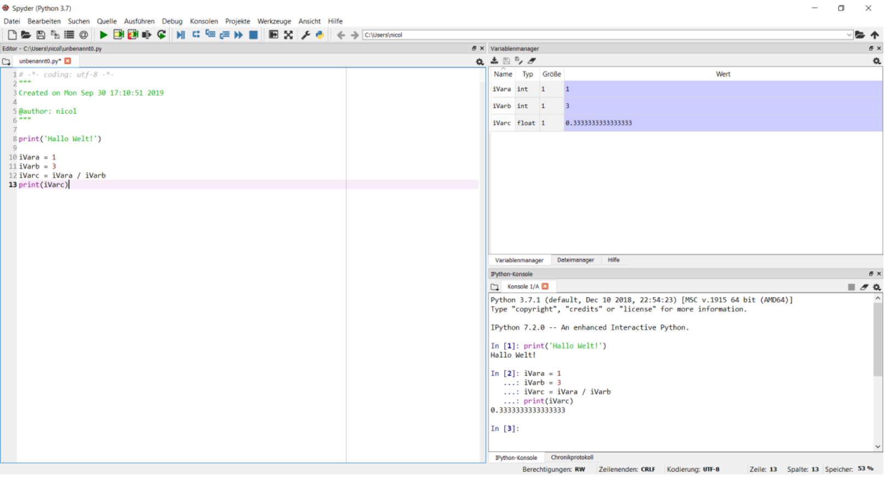
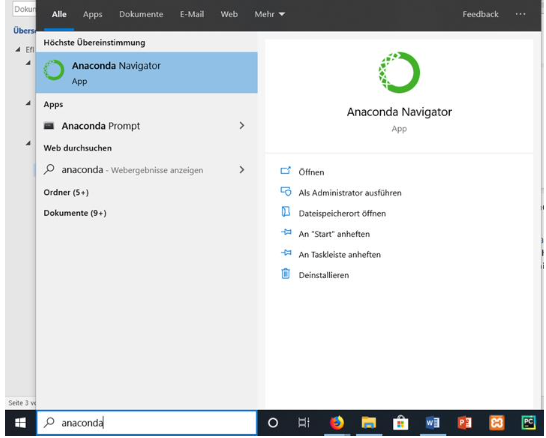
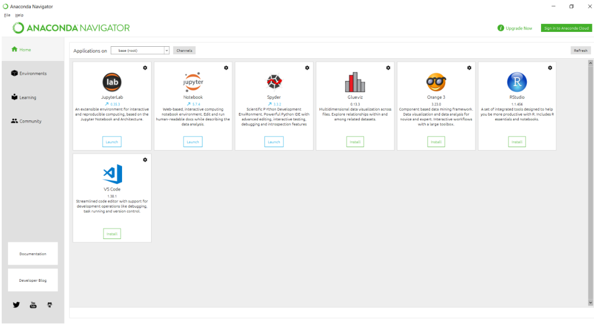
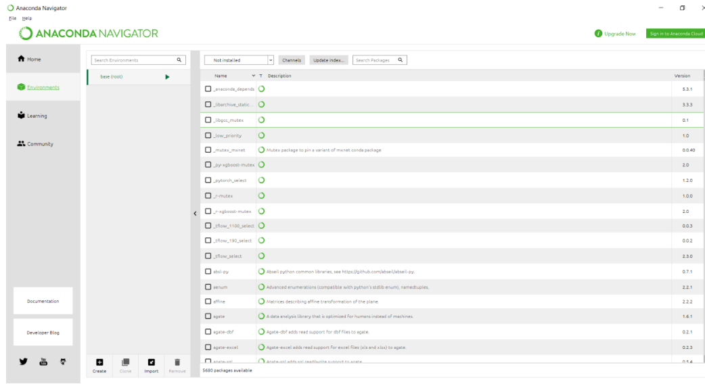
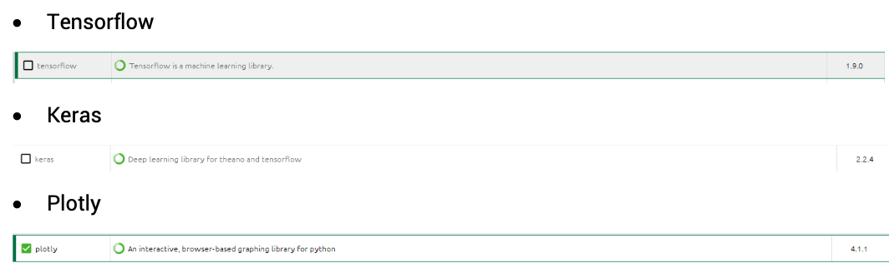
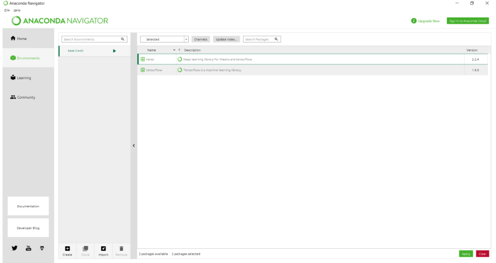

# EFL- Data Science Kurs

Hallo lieber Kursteilnehmer!,

Schön, dass du dich entschlossen hast, in unseren Kursen, etwas über Data Science mit Python zu lernen. Damit du eine optimale Kurserfahrung genießen kannst, sollten allerdings ein paar Grundvoraussetzungen geschaffen werden. Hierfür dient dieses Repository, um das Wissen entsprechend mit dir zu teilen. Zunächst ist es wichtig zu wissen, wie mit diesem Repository umzugehen ist:    

1. Herunterladen:

  - Für Git(hub)-erfahrene Benutzer: Du weißt bereits, wie Repositories "geklont" werden. Bitte verwende eine Methode deiner Wahl. 

  - Für Git(hub)-Anfänger: Bitte klicke auf den grünen 'Code'-Button und lade die Datei als .zip herunter. Speichere und entpacke die .zip-Datei an einem Ort, an dem du diese wiederfinden kannst. Speicher den Pfand zu den Dateien für die spätere Verwendung.

2. Ein aktuelles Arbeitsverzeichnis für diese Kurse erstellen:
Setze anschließend das Arbeitsverzeichnis für deine Entwicklungsumgebung auf den kopierten Repository-Ordner.
Am Beispiel von Spyder: Klicke hierzu in Spyder auf "Extras", dann auf "Optionen" und gehe dann zu "Aktuelles Arbeitsverzeichnis". Klicke auf "das folgende Verzeichnis" und geben den Pfad des Basisverzeichnisses des Repository ein. Jetzt sollte deine Entwicklungsumgebung mit dem Verzeichnis verknüpft sein. 

Im Anschluss findest du eine detaillierte Installationsanleitungen zum Einrichten der Programmierumgebung Spyder bzw. Hinweise zu möglichen Alternativen.

# Installationsanleitungen
Nachdem der Umgang mit dem Repository klar sein sollte, fokussieren wir uns auf die Installation der notwendigen integrierte Entwicklungsumgebung (IDE). Dabei liegt der Fokus auf: 

- Eine funktionierende **Python 3.7–3.10** Installation

- Eine Installation der Entwicklungsumgebung Spyder, sowie der dazugehörenden Paketmanagement-Software Anaconda

- Verschiedene **Python-Paketinstallationen (z.B. Pandas, Numpy, Keras)**, welche innerhalb deiner Python Entwicklungsumgebung nutzbar sind und dir das Programmieren erleichtern.

Diese Voraussetzungen ermöglichen dir ein rundes Python-Programmiererlebnis! Dann schaffen wir mal diese Voraussetzungen.


## Eigener Laptop/ MacBook/Pro/Air
Falls du dich dazu entscheidest einen eignen Computer zu nutzten inkl. einer lokalen Installation der Programmiersprache und Entwicklungsumgebung beachte bitte die folgenden spezifischen Betriebssystembesonderheiten:

### Windows:
Stelle sicher, dass du eine Windows 64-Bit Version hast. Prüfen kannst du das so: 
[Betriebssystem Check](https://www.youtube.com/watch?v=E_rIxF9aDLw)

Falls du eine 32-bit Version besitzt, kannst du nur 32-bit Software installieren. Bitte dies bei der Auswahl der Spyder IDE, sowie Python Installation beachten! Adlerding ist spätestens an Tag 3 (Intro to Data Science) eine 64-bit Installation notwendig! Dies sollte für den Großteil aller aktuellen Notebooks kein Problem darstellen, dennoch bitten wir darum, dies zu überprüfen.

### Mac OS:
Mac User haben es bei der Installation tendenziell einfacher. Eine funktionierende, möglichst aktuelle MacOS-Version genügt.

### Andere Betriebssysteme:
Falls du ein anderes Betriebssystem, beispielsweise auf Basis von Linux, verwendest und nicht weiterkommst, melde dich bitte bei uns.

### Cloud Dienst Nutzung
Falls du keine Möglichkeit hast, Spyder und Anaconda zu installieren, gibt es eine weitere Möglichkeit, wie du an unserem Kurs teilnehmen kannst: Google Colab.
Im Prinzip ist Google Colab nicht mehr als eine Online-Entwicklungsumgebung, in der du mit Jupyter Notebooks/ Ipython-Notebooks arbeitet. Siehe hierzu: [Ipython-Notebooks](https://jupyter-notebook.readthedocs.io/en/stable/notebook.html#notebook-user-interface).
Ein Intro dazu, wie Colab funktioniert, findest du [in der offiziellen Einführung](
https://colab.research.google.com/notebooks/intro.ipynb#).

Das einzige was du brauchst ist:

- Eine funktionierende Internetverbindung

- Ein Google-Konto

- Du musst dich initial mit dem Google Colab Service verbinden, dann kannst du direkt loslegen.

Ein großer Unterschied zwischen Google Colab und Spyder ist der fehlende Variableninspektor. Da man jedoch die Zellen in Colab beliebig oft ausführen kann, lässt sich dieses Problem umgehen indem man sich in einer neuen Zelle einfach die gewünschte Variable ausgeben lässt (denn im Prinzip ist der Variableninspektor auch einfach eine Benutzeroberfläche, welche alle aktiven Variablen in der aktuellen Umgebung anzeigt).

Ein weiterer kleiner Vorteil ist: die meisten Packages, welche wir verwenden werden sind schon vorinstalliert.
Falls ihr also Google Colab verwenden müsst, sollten diese ersten Schritte ausreichen damit ihr vorbereitet seid. Bitte setzt euch allerdings vor dem Kurs mit der User Interface auseinander!


## Python Installation:
Bitte folge einem der folgenden Links für dein jeweiliges Betriebssystem. Das gesamte Vorgehen wird dabei Schritt-für-Schritt erklärt:

[Windows 10/11](hhttps://www.youtube.com/watch?v=QSm8mpMD0R4)

[Windows Installation mehr Details](https://www.youtube.com/watch?v=DiidEp6DqCo)

[Mac OS](https://www.youtube.com/watch?v=36Uu4Gn_A3o)

[Python Offizielle Download Seite](https://www.python.org/downloads/
)
Hinweis: Bitte beachte, dass es einige Abhängigkeiten zu anderen Paketen, wie Keras und Tensorflow gibt. Keras ist nur mit **Python 3.7 bis 3.10** und Tensorflow **Python 3.8–3.11** kompatible. Daher installiere dir am besten die Version [Python 3.9.17](https://www.python.org/downloads/release/python-3917/)


## Installation von Spyder mit Hilfe von Anaconda
Ein wichtiges Tool für Data Scientisten, sowie im allgemeinen Programmierer, sind die Entwicklungsumgebungen. Hierzu zählt beispielsweise Spyder. Anaconda ist der dazugehörige **Software-Paketmanager**, mit dem du zusätzliche Software- Funktionalitäten in deiner Python-Installation integrieren kannst. Diese Pakete ermöglichen damit eine leichtere Programmierung komplexer Funktionalitäten. Bitte folge den folgenden Links, um Spyder und Anaconda zu installieren!

Zunächst kannst du dich über Spyder und Anaconda [hier informieren](https://pypi.org/project/spyder/).
Im Anschluss wähle bitte die passende Installation für dein Betriebssystem aus: [Downloads (ganz am Ende der Seite)](https://www.anaconda.com/download). 

Wenn alles bis hierhin richtig installiert wurde, solltest du ohne Probleme Spyder öffnen um programmieren zu können. Das Ganze könnte dann so aussehen:




## Anaconda und Python Paketinstallationen
Python-Pakete lassen sich relativ einfach in der conda Umgebung installieren, sodass sie dann in Spyder (eurer Programmierumgebung) verfügbar gemacht werden.

Hierzu öffne bitte zunächst den Anaconda Navigator.



Nach dem öffnen des Anaconda Navigator findest du eine Nutzeroberfläche.



Hier wählst du bitte „Environments“ aus. Du befindest dich standardmäßig im root Environment. Dies ist die Umgebung, in welcher deine Python-Pakete zu finden sind und welche standardmäßig für Projekte in Spyder genutzt werden.



Als nächstes selektierst du im rechten Bereich die **„not installed“** packages. Hier werden alle Pakete aufgelistet, welche du noch nicht installiert hast und noch installieren kannst.
Jetzt sollst du folgende Pakete installieren:



Hierzu gibst du den Suchbegriff in die Suchleiste ein und wählst die Pakete über die Checkboxen aus.



Abschließend klickst du auf apply. Dann sollten die Packages installiert werden. Wer sich dazu nochmal ein Video ansehen will, findet es hier auf 
[YouTube - Anaconda Paketinstallation](src/readme/https://www.youtube.com/watch?v=V9cDjjRXS08)

ACHTUNG: Wer eine 32-bit Windows 10 Version haben sollte, bei dem wird TensorFlow nicht installiert werden können! Hierzu bieten wir die PCs in unserem PC-Pool als Ausweichmöglichkeit an.

Super! Deine Entwicklungsumgebung sollte jetzt bereit für den Kurs sein.


## Weitere Vorbereitungsmöglichkeiten
Folgende Webseiten kannst du dir schon einmal als Desktop-Verknüpfung/Favoriten anlegen, da sie hilfreich sein werden:


[Für Coding Beispiele](https://stackoverflow.com/)

[Dokumentation von Python](https://docs.python.org/3/tutorial/)

[Dokumentation von Pandas](https://pandas.pydata.org/pandas-docs/stable/)

[Dokumentation von Numpy](https://docs.scipy.org/doc/)

[EFL-Page](https://www.eflab.de/teaching)


## Trouble Shooting

### Apple M Prozessoren und Tensorflow
Mit der Umstellung von Intel auf die System-on-a-Chip (SoC) Architektur hat Apple eine neue Generation an Prozessoren eingeführt. Diese auf der ARM-Architektur basierte Entwicklung wird auch als Apple Silicon bezeichnet und bei den modernen MacBook, MacBook Air und MacBook Pro Modellen als M1 bzw. M2 Prozessen beworben. Allerdings kam es bei der ersten Generation dieser Prozessoren zu Inkompatibilitäten mit tensorflow. Daher prüfe bitte, ob dein System ähnliche Probleme aufweist. Falls dies der Fall ist, findest du hier eine offizielle Lösung von Apple: 
[Get started with tensorflow-metal](https://developer.apple.com/metal/tensorflow-plugin/)


### Manuelle Installation von Paketen beim Mac
Sollte es generelle Probleme geben Pakete zu installieren, dann kannst du auch eine direkt Installation über das Terminal forcieren. Ein Beispiel zeigen die Codezeilen für das Paket Plotly:

```
$ pip3 install plotly

$ conda install -c plotly plotly=5.16.0
```

### Linux - Docker Container als Alternative
Falls du mit Docker vertraut bist und die Umgebung lieber in einem Container laufen lassen möchtest findest du [hier](https://jupyter-docker-stacks.readthedocs.io/en/latest/index.html) Hilfe für die ersten Schritte. Die Codezeile  zeigt den zentralen Kommandozeilenaufruf, um direkt ein Container mit v-mount und einfacher Port-Zuweisung im home Verzeichnis zu instanziieren.

``` bash
docker run -it --rm -p 8888:8888 -p 4040:4040 -v ~:/home/ubuntu/jupyter jupyter/all-spark-notebook
```


## Umfrage

